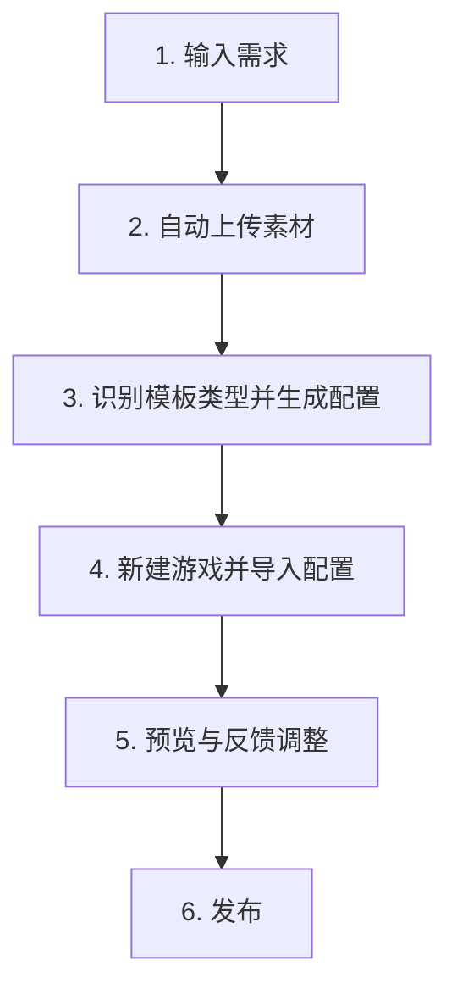

# CoursewareMaker Automation Toolkit

CoursewareMaker Automation Toolkit 是一套面向 CoursewareMaker 课件制作的自动化工具集，用于把“需求输入、素材处理、配置生成、新建游戏、导入保存、预览反馈、发布交付”整理成一条可复用、可校验的标准流程。

项目目标不是让 AI 临场自由生成课件，而是把关键环节尽量沉淀为确定性的脚本、规则和参考配置。AI 主要负责理解需求和任务分发，真正影响稳定性的步骤由工具链执行和校验。

## 适用场景

- 批量制作 CoursewareMaker 游戏
- 根据题目表和素材自动生成游戏配置
- 自动上传图片、音频等素材
- 新建游戏并导入配置
- 对已有游戏做配置更新、回读比对和预览检查
- 沉淀不同游戏模板的制作规则，减少人工重复操作

## 支持的任务类型

### 运动 PK

覆盖赛跑、游泳、赛车等运动 PK 类游戏。

### 模板游戏

覆盖常见模板类游戏，包括：

- 贪吃小怪兽
- 阅读小帆船
- 阅读小火车
- 公路大冒险
- 单词拼拼乐
- 魔法拼拼乐
- 过桥大冒险
- 开心游乐园

### 标准组件化题

用于处理标准组件化配置，重点保证 `game[]` 结构、组件信息和基础状态完整。

## 核心流程



## 工作流说明

1. 输入需求  
   收集游戏名称、题目内容、素材文件、目标游戏信息等。

2. 自动上传素材  
   检查资源库中是否已有同名素材，确认复用或重新上传，生成可写入配置的资源链接。

3. 识别模板类型并生成配置  
   根据需求判断游戏类型，调用对应模板规则生成配置。

4. 新建游戏并导入配置  
   自动创建 CoursewareMaker 游戏，或将配置导入到指定的已有游戏。

5. 预览与反馈调整  
   回读线上配置，预览游戏效果，并根据反馈做最小范围修改。

6. 发布  
   确认配置、资源和预览效果无误后发布。

## 项目特点

- **流程标准化**：把课件制作拆成固定环节，降低沟通和协作成本。
- **脚本确定性执行**：配置生成、资源匹配、校验和保存尽量由脚本完成，减少模型差异带来的不稳定。
- **按游戏类型隔离**：不同游戏类型使用各自的生成规则、参考配置和校验方式，避免串类型。
- **参考配置沉淀**：模板骨架、固定资源和关卡级结构被保存在仓库中，便于复用和追溯。
- **关卡级校验**：支持按单关识别不同题型形态，例如题干是否有文字、音频、配图，选项是文字还是图片。
- **回读与预览闭环**：保存后重新读取线上配置并预览，避免只看接口成功而忽略实际效果。

## 目录结构

```text
CoursewareMaker_Automation_Toolkit/
├── workflow/                 # 工作流路由、规划、执行和校验策略
├── scripts/                  # 生成、上传、保存、发布、校验等脚本
├── reference_configs/         # 各类游戏参考配置和关卡级参考
├── resources/                # 资源列表与素材同步说明
├── validation_fixtures/       # 校验用例和回归材料
├── standard_question_toolkit/ # 标准组件化题相关工具
├── docs/                     # 详细流程文档、专项模板说明和排查文档
└── output/                   # 本地运行输出目录，通常不作为交付内容
```

## 常用入口

### 工作流执行器

```bash
python3 workflow/workflow_executor.py -m "用户需求描述"
```

### 工作流静态审计

```bash
python3 workflow/audit_workflow.py
```

### 资源同步

```bash
python3 scripts/sync_courseware_resources.py
```

### 关卡级参考索引生成

```bash
python3 scripts/build_reference_level_index.py
```

## 文档入口

- `WORKFLOW.md`：主工作流说明
- `docs/WORKFLOW_DEBUG_FLOWCHART.md`：工作流流程图与排查说明
- `docs/COURSEWAREMAKER_AUTOMATION_GUIDE.md`：较完整的技术指南
- `docs/DOCUMENTATION_INDEX.md`：文档索引
- `resources/README.md`：资源列表和素材同步说明
- `validation_fixtures/README.md`：校验用例说明

## 环境要求

- Node.js
- Python 3
- Chrome 或 Edge 浏览器
- CoursewareMaker 登录态

部分保存、预览和发布流程需要浏览器开启远程调试端口，并确保当前浏览器已登录 CoursewareMaker。

## 简要价值

这套工具把依赖人工经验的课件制作过程沉淀成可执行、可校验、可复用的流程。它可以提升批量制作效率，降低素材和配置出错率，并让不同游戏模板的制作规则更容易维护和传承。
