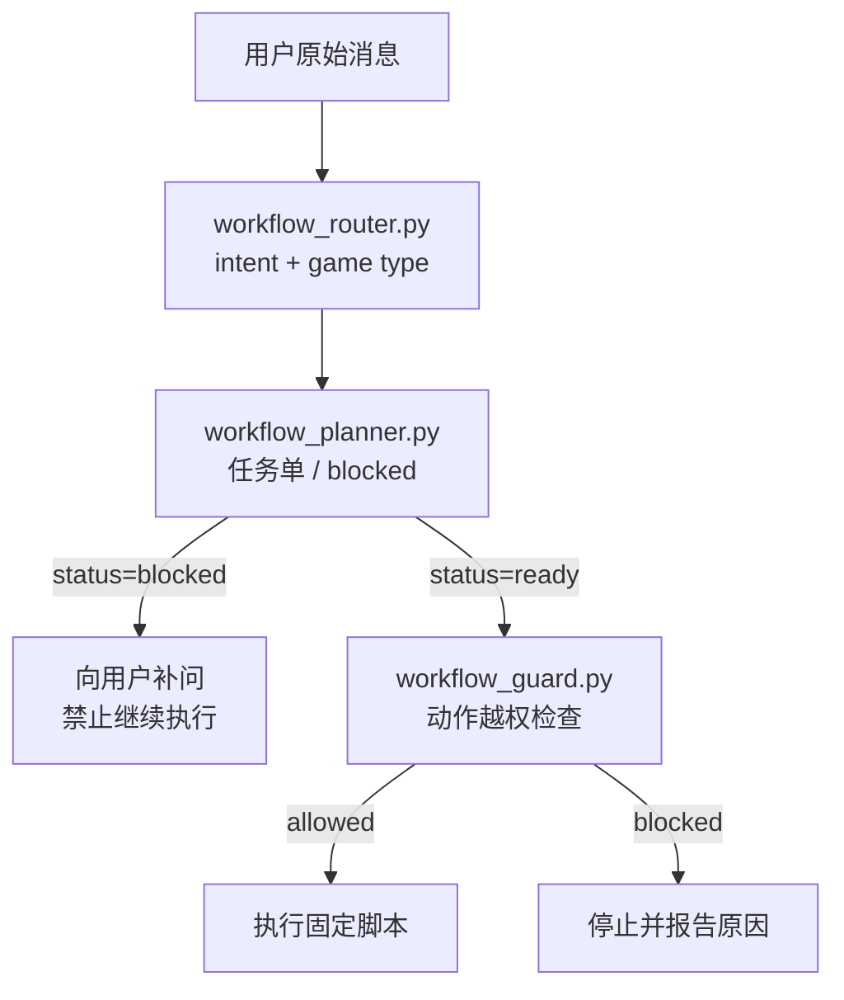
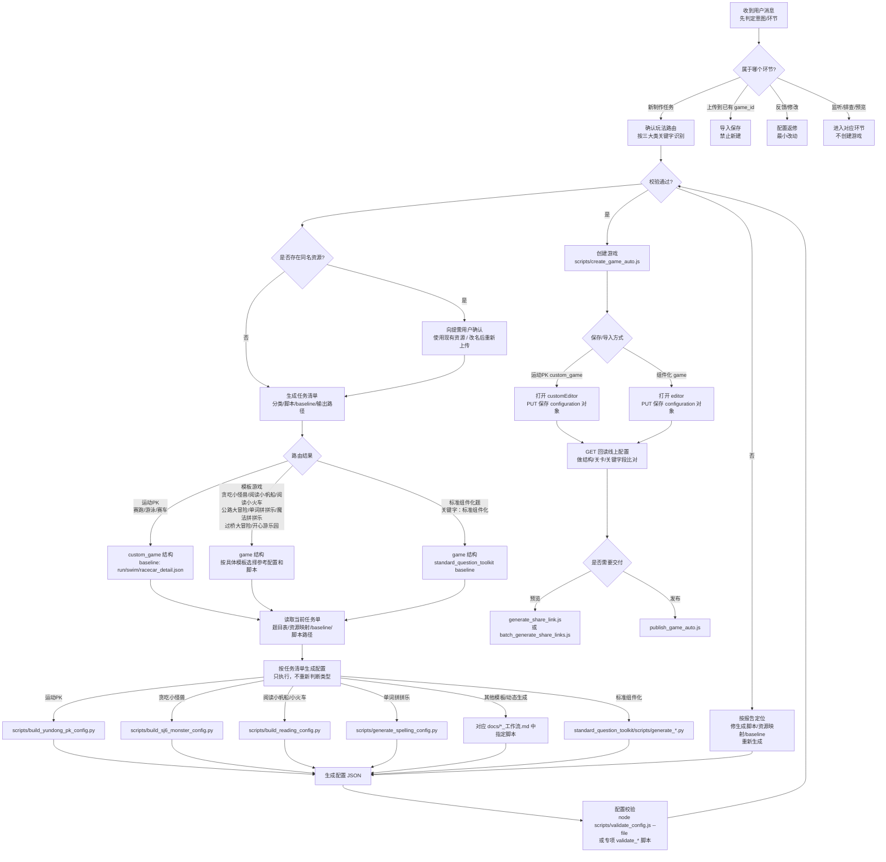
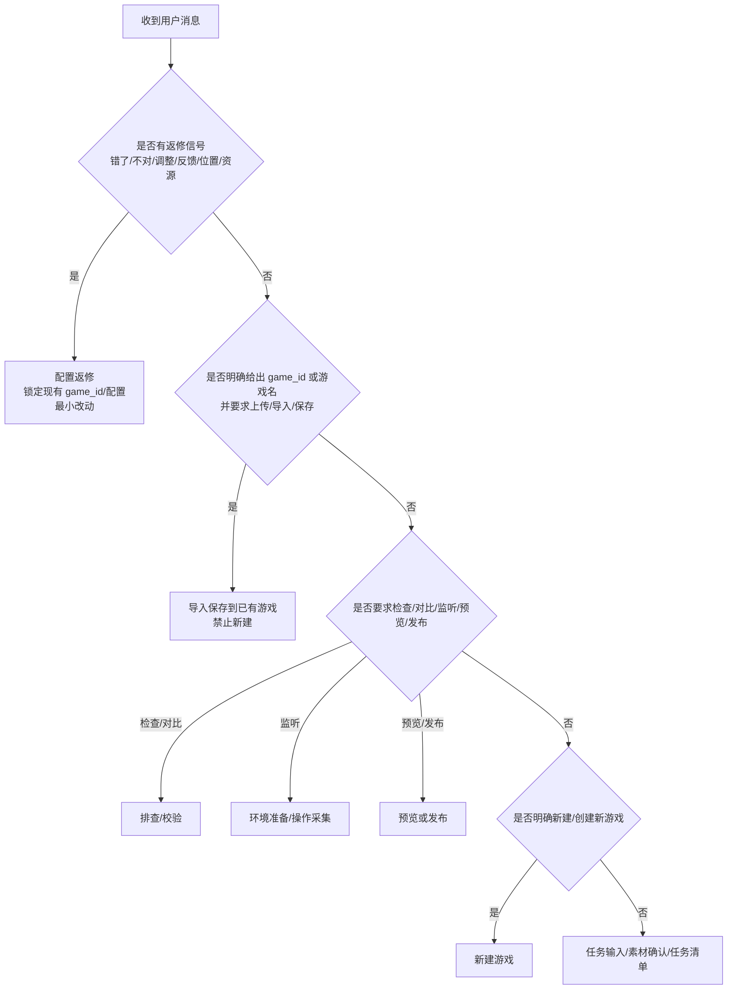
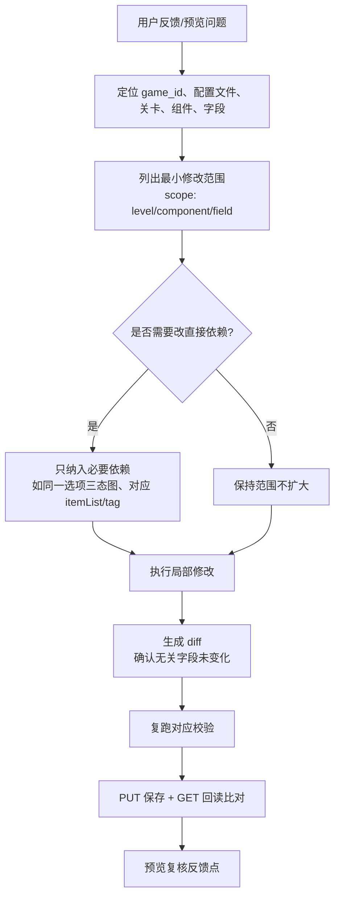
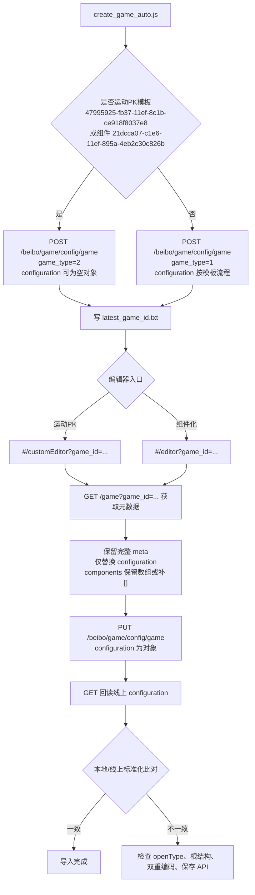
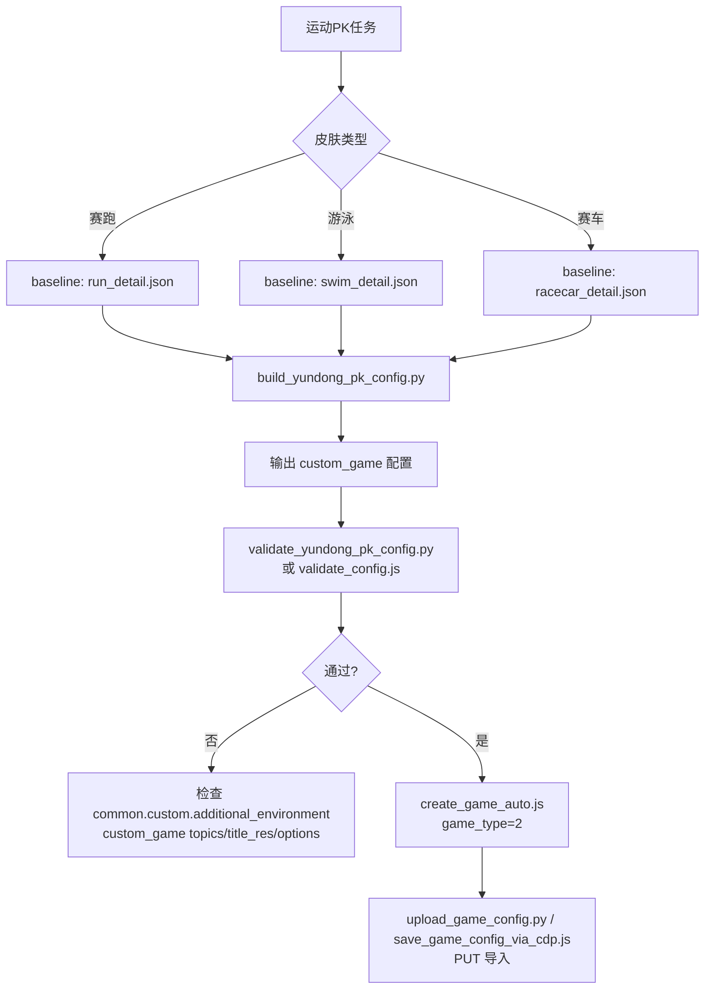

# CoursewareMaker 工作流排查流程图

> 排查入口文档。用于把“任务输入 → 资源 → 配置生成 → 校验 → 创建 → 导入保存 → 分享/发布”的完整链路串起来，并明确每个环节的规则、脚本入口和常见故障点。

## 零、确定性控制层

为减少不同端、不同模型带来的判断差异，工作流入口前置为确定性脚本。AI 不能直接决定“新建/导入/返修/发布”，必须先调用规则引擎生成结构化结果。



固定入口：

```bash
python3 workflow/workflow_router.py -m "<用户消息>" --pretty
python3 workflow/workflow_router.py -m "<用户消息>" | python3 workflow/workflow_planner.py --pretty
python3 workflow/workflow_router.py -m "<用户消息>" | python3 workflow/workflow_planner.py | python3 workflow/workflow_guard.py --action <action> --pretty
```

机器可读规则：

- `workflow/intent_rules.json`
- `workflow/game_type_rules.json`
- `workflow/stage_policy.json`
- `workflow/script_registry.json`
- `workflow/validation_policy.json`

AI 的职责被限制为：把用户消息传给 router、按 planner 的 `blocked` 结果补问、按 ready plan 执行固定脚本、解释脚本错误。不得绕过 `workflow_guard.py` 执行被禁止的动作。

## 一、总流程图



## 二、用户意图与环节判定

收到用户消息后，先判定“这句话属于哪个工作流环节”，再识别游戏类型。游戏类型路由只用于新任务、配置生成和校验；如果用户是在反馈问题或要求修改已有配置，不能重新进入“新建游戏”环节。

意图判定优先级：

| 优先级 | 用户话术信号 | 归属环节 | 允许动作 | 禁止动作 |
|---|---|---|---|---|
| 1 | 包含 `不对`、`错了`、`资源用错`、`位置不好`、`改一下`、`调整`、`反馈`、`预览看到`、`刚才那个`、`这个游戏` | 配置返修 | 定位现有 `game_id`/配置，做最小字段修改，保存回读 | 新建游戏、重新生成无关关卡、替换模板 |
| 2 | 明确给出 `game_id=` 或具体游戏名，并说 `上传`、`导入`、`保存`、`试一下` | 导入保存/跑通验证 | 先解析目标游戏；`game_id` 优先，游戏名必须查到唯一游戏后再保存配置并回读 | 新建游戏、使用同名游戏中任意一个、用 `latest_game_id.txt` 猜 |
| 3 | 说 `检查`、`对比`、`为什么`、`差异`、`能不能跑通`、`看下问题` | 排查/校验 | 读取配置、日志、接口回读、给结论；必要时试保存到指定 game_id | 未经要求创建新游戏或发布 |
| 4 | 说 `打开监听浏览器`、`记录操作`、`监控` | 环境准备/操作采集 | 打开 CDP 浏览器、监听接口、记录手动操作 | 修改配置或新建游戏 |
| 5 | 说 `预览`、`分享链接`、`发布` | 预览/发布 | 生成预览链接或执行发布流程 | 改配置、新建游戏 |
| 6 | 明确说 `新建`、`创建一个新的`、`生成一个新的游戏`、`名字叫...` | 新建游戏 | 按任务单创建新游戏，再进入导入保存 | 复用旧 `latest_game_id` 或旧配置 |
| 7 | 提供题目/素材/需求清单或输入文件，但没有现有 `game_id` 和返修信号 | 新制作任务 | 先锁定题目/配置输入文件和游戏类型，再进入素材确认、任务清单、配置生成 | 未锁定输入文件就生成、跳过素材确认或复用上一任务状态 |

硬规则：

- 只要用户话术是“反馈/修改/调整/错了”，默认进入配置返修；除非用户同时明确说“新建一个新的游戏”。
- 只要用户提供了目标 `game_id` 或具体游戏名，并要求上传/导入/保存，必须使用该已有游戏；不得因为识别到游戏类型关键字而新建游戏。
- 目标定位优先级：`game_id` 精确命中最高；没有 `game_id` 时按游戏名精确查询；如果同名或近似多条命中，必须让用户确认具体目标。
- 用户只给游戏名时，保存/返修前必须先回读该游戏详情，确认 `game_id`、`game_name`、`game_type`、编辑器入口和当前配置结构。
- “资源用错、选项位置不好、放置区排版不好、音频错、正确项错”都属于返修，不属于新建。
- “试一下把这个配置上传到 game_id=...”属于导入保存验证，不属于新建。
- 如果意图不明确，先问一句确认“是修改已有 game_id 还是新建游戏”，不能自行创建。
- 进入返修环节时必须继承当前任务单或线上配置上下文；若缺少 `game_id`/游戏名/配置路径，只能先定位或询问，不能用 `latest_game_id.txt` 猜。

判定流程：



## 三、强制路由规则

路由优先级高于模板 ID。先判断配置根结构和 baseline，再选择脚本。

| 路由 | 数据结构 | baseline | 生成脚本 | 创建/编辑入口 |
|---|---|---|---|---|
| 运动PK：赛跑/游泳/赛车 | `custom_game` | `templates/detail_jsons/run_detail.json`、`swim_detail.json`、`racecar_detail.json` | `scripts/build_yundong_pk_config.py` | `game_type=2`，`#/customEditor?game_id=...` |
| 模板游戏：贪吃小怪兽、阅读小帆船、阅读小火车、公路大冒险、单词拼拼乐、魔法拼拼乐、过桥大冒险、开心游乐园 | `game` | 对应模板参考配置 | 对应模板生成脚本 | `game_type=1`，`#/editor?game_id=...` |
| 标准组件化题：标准组件化 | `game` | `standard_question_toolkit/data/courseware_workflow_rules.json` | `standard_question_toolkit/scripts/generate_*.py` | `game_type=1`，`#/editor?game_id=...` |

关键原则：

- 运动PK不能走普通 `game` 导入路径，必须保持 `custom_game` 根结构。
- 模板游戏先按关键字进入具体模板工作流；多数是“复制替换型”：从参考配置 deepcopy，只替换题干、音频、图片、选项、正确项，不重排 `components[]`。背景、皮肤、spine、组件 bundle、状态 key、公共层和布局骨架可以固定；题目相关信息必须来自锁定输入文件或素材确认结果。
- `components[]` 顺序决定实际渲染层级，越靠后越在上层；`zIndex` 多数只作编辑器显示参考。
- 生成配置后必须先校验，再导入保存。

## 四、实际游戏类型拆分

### A. 运动PK

| 实际类型 | 关键字 | baseline | 生成/校验 |
|---|---|---|---|
| 赛跑 | `赛跑` | `templates/detail_jsons/run_detail.json` | `scripts/build_yundong_pk_config.py` + `scripts/validate_yundong_pk_config.py` |
| 游泳 | `游泳` | `templates/detail_jsons/swim_detail.json` | `scripts/build_yundong_pk_config.py` + `scripts/validate_yundong_pk_config.py` |
| 赛车 | `赛车` | `templates/detail_jsons/racecar_detail.json` | `scripts/build_yundong_pk_config.py` + `scripts/validate_yundong_pk_config.py` |

共同规则：根结构必须是 `custom_game`，创建时 `game_type=2`，编辑器入口 `customEditor`。

### B. 模板游戏

| 实际类型 | 关键字 | 工作流/脚本 | 关键规则 |
|---|---|---|---|
| 贪吃小怪兽 | `贪吃小怪兽` | `scripts/build_sj6_monster_config.py`、`docs/MONSTER_WORKFLOW.md` | 复制替换型，三态选项，反馈资源 |
| 阅读小帆船 | `阅读小帆船` | `scripts/build_reading_config.py --type fanboat`、`docs/阅读小帆船_工作流.md` | 读取 fanboat 参考配置索引 |
| 阅读小火车 | `阅读小火车` | `scripts/build_reading_config.py --type train`、`docs/阅读小火车_工作流.md` | 读取 train 参考配置索引 |
| 公路大冒险 | `公路大冒险` | `docs/公路大冒险_工作流.md` | 先确认绿地/沙漠等背景参考配置 |
| 单词拼拼乐 | `单词拼拼乐` | `scripts/generate_spelling_config.py`、`docs/SPELLING_WORKFLOW.md` | slot/space/fixed 顺序，`double_encoded=false` |
| 魔法拼拼乐 | `魔法拼拼乐` | `scripts/generate_mofappl_config.py`、`docs/MOFAPPL_WORKFLOW.md` | 数据映射、组件层级、State 规则 |
| 过桥大冒险 | `过桥大冒险` | `docs/过桥大冒险_动态生成工作流.md` | 桥区槽位、字号、组件命名匹配 |
| 开心游乐园 | `开心游乐园` | `docs/开心游乐园_动态生成工作流.md` | 槽数、组件命名、`components[]` 渲染层级 |

共同规则：根结构是 `game`，创建时 `game_type=1`，编辑器入口 `editor`。多数模板游戏从参考配置 deepcopy，只替换内容字段，不重排 `components[]`。

### C. 标准组件化

| 实际类型 | baseline | 校验重点 |
|---|---|---|
| 标准选择题 | `standard_choice` | 选择按钮组件与状态资源 |
| 标准填空/计算题 | `standard_fill_compute` | 输入框、键盘、题干 label、布局常量 |
| 标准拖拽题 | `standard_drag` | 拖拽物、放置框、题干 label、背景 |

共同规则：根结构是 `game`。主流程先用 `standard_question_toolkit/scripts/validate_standard_component_config.py` 做稳定结构校验；锁定具体皮肤 baseline 后，可再用 `scripts/validate_config.js` 做布局/皮肤高级诊断。

## 五、素材确认与同名资源规则

素材确认在批次拆分与制作之前完成。上传前必须先查询现有资源 list，检查是否存在同名资源。

同名资源处理规则：

- 如果不存在同名资源：可以继续上传，并记录上传后返回的真实 URL。
- 如果存在同名资源：先暂停上传，向提需用户确认。
- 提需用户确认“直接使用现有资源”时，才把现有资源 URL 写入资源映射。
- 提需用户确认“重新上传”时，必须先改名再上传，避免同名资源混淆。
- 未确认前禁止默认复用同名资源，也禁止默认覆盖/重新上传。

素材确认输出：

- 每个素材的最终资源 URL
- 是否复用已有资源
- 是否改名上传
- 同名资源确认记录

## 六、生成任务清单与防串类型规则

如果一次性提供多种不同游戏需求，必须先生成任务清单。任务清单只做决策锁定，不真正生成配置；后续制作按任务单逐条执行。

每张任务单至少锁定：

- `game_family`：`运动PK` / `模板游戏` / `标准组件化题`
- 命中的关键字
- 具体游戏名
- 对应 template / baseline
- 生成脚本路径
- 输出配置路径
- 素材 URL 映射
- `game_type`
- 编辑器入口（`editor` / `customEditor`）
- 目标 `game_id`（新建后写入）

禁止跨任务共享：

- 上一个任务的 `template_id`
- 上一个任务的 baseline JSON
- 上一个任务的 `game_type`
- 上一个任务的编辑器入口（`editor` / `customEditor`）
- 上一个任务的 `config_path`
- 上一个任务的 `latest_game_id.txt`

批量脚本必须在每条任务循环内重新读取当前任务单的 `game_family`、脚本路径、输出路径和创建参数。不能只在批量开始时判断一次类型，否则整批会被错误地按同一种类型制作。

配置生成阶段只读取任务清单执行，禁止重新猜类型、临时换脚本或复用上一条任务的 baseline。

## 七、阶段规则与排查点

| 阶段 | 输入 | 输出 | 必查规则 | 主要脚本 | 常见问题 |
|---|---|---|---|---|---|
| 意图判定 | 用户原始消息、上下文、是否有 `game_id` 或具体游戏名 | 当前应进入的工作流环节 | 先跑确定性 router；反馈/修改和已有目标游戏导入都不得触发新建；router/planner blocked 时必须停下补问 | `workflow/workflow_router.py`、`workflow/intent_rules.json`、`workflow/stage_policy.json` | AI 自由判断导致把返修反馈误判成新任务 |
| 目标游戏解析 | `game_id`、游戏名、上下文任务单 | 唯一目标 `game_id` 和游戏详情 | `game_id` 优先；无 `game_id` 时按游戏名精确查询；同名/多结果必须确认；解析后回读 `game_name/game_type/configuration` | 游戏详情 GET、游戏列表/搜索接口、回读脚本 | 同名游戏误选、用最新创建 ID 代替用户指定名称 |
| 环境准备 | Chrome/Edge 登录态、CDP 端口 | 可读取 token/cookie 的浏览器会话 | CDP 端口通常为 `9222` 或 `9223`；必须登录 CoursewareMaker | `docs/check_environment.sh` | 脚本取不到 token、浏览器未开调试端口 |
| 素材确认 | 本地素材、资源表、已有 URL、资源 list | 可写入配置的素材 URL 和同名确认记录 | 上传前先查同名资源；同名时先问提需用户使用现有资源还是改名上传；上传后确认真实 URL；资源 list 必须保存在 git 项目内并持续合并 | `resources/latest_resources.json`、`courseware_bulk_upload_assets.mjs`、`scripts/sync_courseware_resources.py` | 同名资源误复用、未改名上传导致混淆、URL 缺失、使用项目外旧资源表 |
| 生成任务清单 | router 输出、素材 URL 映射、题目清单 | 每个游戏一张任务单或 blocked 原因 | 锁定 game_family、关键字、template/baseline、生成脚本、输出路径、game_type、编辑器入口；不生成配置 | `workflow/workflow_planner.py`、`workflow/script_registry.json` | 多游戏混在同一上下文、复用上一条任务状态 |
| 配置生成 | 当前任务单、题目表、参考配置、资源 URL | 本地 `.config.json` + build-meta | 只按任务清单执行，不重新判断类型；复制替换型不重排组件；模板固定资源可继承，题目相关字段必须来自输入 | 各 `build_*` / `generate_*` 脚本 | 生成阶段重新猜类型、用错 baseline、题型识别错、资源映射错、题目字段仍写死在脚本常量 |
| 配置校验 | 本地配置 JSON、当前任务单 | 分层校验报告 | 主工作流按 `validation_policy.json` 调度：规则脚本校验为主，参考配置不变量和关卡级 profile 对比为辅，案例回归用于防止脚本退化；模板游戏统一跑 `validate_template_game_config.py`，贪吃小怪兽/运动PK跑更强专项 validator；保存后统一回读比对和预览 | `workflow/workflow_planner.py`、`workflow/validation_policy.json`、`workflow/game_input_schemas.json`、各专项 validator | 根结构不对、皮肤不匹配、缺组件、状态图错、模板被误判成标准拖拽题、只做案例 diff 没跑规则 |
| 新建游戏 | 游戏名、模板 ID、可选初始配置 | `game_id` | 运动PK模板必须 `game_type=2`；普通组件化 `game_type=1` | `scripts/create_game_auto.js` | 运动PK被建成普通游戏、入口 URL 错 |
| 导入保存 | 唯一目标 `game_id`、配置 JSON | 线上保存成功 | 执行器已接管已有游戏导入分支；当前自动保存要求显式 `game_id`，游戏名解析必须先得到唯一 `game_id` 后再保存；保存语义：GET 完整元信息，只替换 `configuration`，保留/补齐 `components: []`，再 `PUT /beibo/game/config/game`；`configuration` 必须是对象，不是字符串 | `workflow/workflow_executor.py`、`scripts/save_game_config_via_cdp.js`、`scripts/upload_game_config.py` | POST 被当成另存、游戏名重复、双重编码、cookie 缺失 |
| 回读比对 | 线上游戏详情、本地配置 | 比对结果 | GET 回读后比对关卡数、根结构、关键组件、题目字段 | 保存脚本内置比对或临时比对脚本 | API 成功但配置未真正写入、引用模式导致只读 |
| 配置返修 | 用户反馈、当前线上/本地配置、任务单 | 最小修改后的配置 | 只改用户明确反馈项和直接依赖；禁止顺手优化、重排组件、换模板、替换无关资源；返修后必须复跑对应校验和回读比对 | 对应生成脚本、局部修正脚本、差异比对脚本 | 修一个资源时误改布局、调一个选项时重排整关、跨关复制导致无关题目变化 |
| 分享/发布 | `game_id`、发布信息 | 预览链接或已发布游戏 | 分享链接 7 天有效；发布流程 unlock 必须 POST | `scripts/generate_share_link.js`、`scripts/publish_game_auto.js` | 发布第 4 步用 PUT 导致 404 |

## 八、配置返修边界

预览或用户验收后，经常会出现“资源用错”“选项位置不好”“放置区太挤”“音频不对”“某一题正确项错”等局部反馈。返修必须按最小变更原则执行，不能把返修当成重新生成全量配置的机会。

返修硬规则：

- 只修改用户明确反馈的关卡、组件和字段，以及为了使该反馈生效所必需的直接依赖字段。
- 禁止因为“看起来可以顺手优化”而修改无关关卡、无关选项、无关资源、背景、模板、公共层、组件顺序或创建参数。
- 复制替换型模板游戏不得在返修时重排 `components[]`；除非用户反馈就是遮挡/点击层级问题，并且已确认必须改组件顺序。
- 资源替换只替换被点名的资源字段；如果发现同名资源或疑似更合适资源，必须先确认，不能自行切换。
- 排版调整只调整被反馈的组件坐标、尺寸、字号或间距；不得重算整关布局，除非用户反馈是整关布局规则错误。
- 正确项/答案关系调整只改对应题和对应放置区/选项 tag；不得批量重写所有答案关系。
- 返修前先保存一份待修改配置或记录 diff；返修后必须输出“改了哪些字段、为什么改、没有改哪些相邻字段”。
- 返修后复跑对应校验；保存后 GET 回读并与返修后的本地配置比对。

返修流程：



常见反馈的允许修改范围：

| 反馈类型 | 允许改 | 不应改 |
|---|---|---|
| 资源用错 | 被反馈组件对应的图片/音频 URL；必要时同一组件三态资源 | 其他题资源、背景、模板皮肤、组件顺序 |
| 选项排版不好 | 被反馈选项的 x/y/width/height/fontSize；必要时同组间距 | 正确项、资源 URL、其他关卡布局 |
| 放置区位置不好 | 被反馈放置区坐标/尺寸；必要时对应拖拽物吸附关系 | 无关放置区、全局模板、题干资源 |
| 正确答案错 | 对应选项 `anwserRadio`、拖拽 tag、放置区 `itemList` | 选项视觉资源、其他题答案 |
| 音频错/缺失 | 对应音频状态的 `MAudio.value` | 图片、坐标、反馈动效 |
| 遮挡/点击不到 | 先查 `components[]` 顺序，只改必要组件层级或顺序 | 大范围重排整关、只改无效 `zIndex` |

## 九、创建与保存链路细图



保存规则：

- 更新已有游戏使用 `PUT`，不要用 `POST`。
- 保存 payload 统一来自 `GET /game` 返回的完整元信息，只替换 `configuration`。
- `configuration` 必须是 JSON 对象，不能是 JSON 字符串。
- `components` 字段保留 GET 返回数组；如果不是数组则补 `[]`，与手动保存保持一致。
- `save_game_config_via_cdp.js` 使用浏览器 `credentials: "include"`；`upload_game_config.py` 使用显式 `GAMEMAKER_TOKEN` 和 `GAMEMAKER_COOKIE`，但 payload 结构一致。
- 编辑器 URL 如果含 `openType=1`，通常是引用/只读模式，写入应中止。

## 十、运动PK专项排查



运动PK硬规则：

- 模板 ID：`47995925-fb37-11ef-8c1b-ce918f8037e8`
- 组件 ID：`21dcca07-c1e6-11ef-895a-4eb2c30c826b`
- 新建必须 `game_type=2`
- 编辑器入口必须是 `customEditor`
- 配置根结构必须包含 `custom_game`
- 可先创建空壳 `{}`，再导入完整配置

## 十一、模板游戏规则

适用：贪吃小怪兽、阅读小帆船、阅读小火车、公路大冒险、单词拼拼乐、魔法拼拼乐、过桥大冒险、开心游乐园。


排查重点：

- 先确认参考配置是否属于目标游戏、目标皮肤、目标槽位数量。
- 不要在生成脚本里随意重排 `components[]`。
- 如果组件被遮挡，优先修参考配置或组件顺序来源，而不是只改 `zIndex`。
- 动态生成类文档中写明的槽位规则、字号规则、命名匹配规则优先于通用规则。
- 单词拼拼乐虽然有独立 slot/space/fixed 规则，但一级分类仍归入模板游戏。

### 分层校验流程

校验分为主工作流职责和单游戏职责，不能混在一起：

| 层 | 归属 | 是否必需 | 作用 |
|---|---|---|---|
| `rules_validator` | 单游戏 | 必需 | 用规则脚本校验输入 schema、字段映射、资源类型、正确项、tag/itemList、组件层级等确定性规则 |
| `reference_invariants` | 单游戏 | 必需 | 只对比固定模板不变量：公共层、组件注册表、关键 state、固定皮肤资源、骨架顺序 |
| `level_reference_profile` | 单关卡 | 必需/推荐 | 从 `reference_configs/level_references/index.json` 逐关匹配结构和题型形态；记录槽位数、题干文字/音频/配图、选项文字/音频/图片 |
| `fixture_regression` | 单游戏 | 可选 | 用代表性案例防止脚本退化；案例缺失只记 warning，不替代规则校验 |
| `roundtrip_compare` | 主工作流 | 必需 | 保存后 GET 回读并和本地配置规范化比对 |
| `preview` | 主工作流 | 必需 | 浏览器预览首关交互、音频、正确/错误反馈、翻页 |

主工作流不写死某个游戏的 tag、槽位或素材规则，只读取 `validation_policy.json` 选择该游戏的校验入口。单个游戏文档和 validator 负责解释“为什么这样校验”。

### 模板游戏校验流程

模板游戏的校验不能只看根结构。它们和标准组件化题一样使用 `game` 数组，但组件语义、命名、状态和渲染顺序由具体模板决定。如果直接运行标准组件化 baseline，过桥大冒险、开心游乐园等会被误判成标准拖拽题。

模板游戏统一按下面六层校验：

1. 基础结构校验：JSON 可解析；根结构必须包含 `common`、`game`、`additional`、`components`；`game.length` 与题目数一致；保存 payload 中 `configuration` 必须是对象，不是字符串。
2. 模板专项规则校验：按具体模板检查题型规则、槽位数量、tag、正确答案、字号、桥区/道路/游乐园布局、三态图、反馈动效和音效。
3. 参考配置不变量校验：从任务单锁定的参考配置读取结构，不允许随意重排 `components[]`；公共层、注册表、`levelData.uiConfig`、模板专属状态名和组件名必须保留；只替换题干、音频、图片、选项、正确项等内容字段。
4. 关卡级 profile 校验：运行 `scripts/build_reference_level_index.py` 后，`validate_template_game_config.py --reference-index reference_configs/level_references/index.json` 按每一关匹配格式；例如 L1 是 4 槽、L2 是 3 槽，或 L1 是纯音频题干、L2 是音频+文字/配图题干时分别找对应 profile。
5. 案例回归：如果存在 `validation_fixtures/template_game/<subtype>/`，用代表性案例跑生成和校验，防止脚本改坏；没有案例不能当作通过依据。
6. 保存后校验：导入保存后 GET 回读，和本地配置规范化比对；再进入预览页做首关交互、正确/错误反馈、翻页和音频播放检查。

| 模板 | 当前校验入口 | 必查规则 |
|---|---|---|
| 贪吃小怪兽 | `scripts/validate_monster_config.py`、`scripts/check_monster_vs_ref.py` | 3 个点击选择、唯一正确项、题干音频、纯文字题干样式、底图节点、正确/错误反馈动效 |
| 阅读小帆船 | `scripts/build_reading_config.py --type fanboat` 内置校验 + `scripts/validate_template_game_config.py --subtype fanboat` | 选项数、放置区数、tag 规则、题干音频、拖拽音效、itemList |
| 阅读小火车 | `scripts/build_reading_config.py --type train` 内置校验 + `scripts/validate_template_game_config.py --subtype train` | train 参考配置、选项数、放置区数、tag 规则、题干音频、itemList |
| 公路大冒险 | `scripts/generate_guoji_l2_shu4_road.py` 输入校验 + `scripts/validate_template_game_config.py --subtype road_adventure` | 绿地/沙漠参考配置、3 个 AloneClickChoice、唯一正确项、三态选项图、反馈资源、`components[]` 层级 |
| 单词拼拼乐 | `scripts/generate_spelling_config.py` 输入校验 + `scripts/validate_template_game_config.py --subtype spelling` | slot/space/fixed 顺序、拖拽物、答题区、题图、音频、`double_encoded=false` |
| 魔法拼拼乐 | `scripts/generate_mofappl_config.py` 输入校验 + `scripts/validate_template_game_config.py --subtype magic_spelling` | 槽位模板、sentence_parts、音频、拖拽物正确/错误态、fin 动效和层级 |
| 过桥大冒险 | `scripts/generate_guoqiao_shu2.py` 输入校验 + `scripts/validate_template_game_config.py --subtype bridge` | 桥区槽位、拖拽项、itemList、句号组件、统一槽宽、自适应字号、选项最上层 |
| 开心游乐园 | `scripts/generate_kaixin_shu2.py` 输入校验 + `scripts/validate_template_game_config.py --subtype amusement_park` | 槽数、选项数、correct 属于 options、选项音频、场景图仅显式提供时替换、`components[]` 渲染层级 |

## 十二、脚本索引

| 脚本 | 用途 | 排查时看什么 |
|---|---|---|
| `scripts/create_game_auto.js` | 新建游戏 | `game_type`、模板 ID、编辑器入口、`latest_game_id.txt` |
| `scripts/save_game_config_via_cdp.js` | CDP 浏览器通道保存配置，主推荐 | `credentials: include`、完整 meta、`configuration` 是否对象、回读比对 |
| `scripts/upload_game_config.py` | API 直传通道保存配置，备用/批处理 | token/cookie、完整 meta、`components: []`、`configuration` 是否对象 |
| `standard_question_toolkit/scripts/validate_standard_component_config.py` | 标准组件化主流程校验 | `game[]`、`components[]`、`component_id`、`component_data`、基础 state 结构 |
| `scripts/validate_config.js` | 运动PK和标准组件化高级诊断 | 皮肤、组件互斥、状态资源、布局常量；标准组件化需先锁定稳定 baseline，不要直接用于模板游戏 |
| `scripts/validate_yundong_pk_config.py` | 运动PK专项校验 | 皮肤 baseline、`custom_game`、题目字段 |
| `scripts/validate_monster_config.py` | 贪吃小怪兽专项校验 | 题干音频、点击选择、唯一正确项、底图节点 |
| `scripts/validate_template_game_config.py` | 模板游戏通用生成后规则校验 | `game[]`、输入 schema、选项数、唯一正确项、拖拽 itemList、音频/图片存在 |
| `scripts/build_reference_level_index.py` | 生成关卡级参考库 | 从 `reference_configs/` 拆出每关 level JSON，生成 `reference_configs/level_references/index.json` profile |
| `workflow/audit_workflow.py` | 工作流静态审计 | adapter、生成脚本、模板、validator、资源 list、fixtures |
| `workflow/game_input_schemas.json` | 每游戏确定性输入契约 | 必填字段、资源字段、固定模板资源与动态题目字段边界 |
| `scripts/build_yundong_pk_config.py` | 生成运动PK配置 | Sheet 识别、run/swim/racecar baseline、资源映射 |
| `scripts/build_sj6_monster_config.py` | 生成贪吃小怪兽配置 | 题型分类、三态选项、反馈资源 |
| `scripts/build_reading_config.py` | 生成阅读小帆船/小火车配置 | `--type fanboat/train`、tag 规则、参考配置索引 |
| `scripts/generate_spelling_config.py` | 生成单词拼拼乐配置 | slot/space/fixed 顺序、拖拽物、`double_encoded=false` |
| `scripts/generate_share_link.js` | 生成预览链接 | `game_id`、base preview URL |
| `scripts/publish_game_auto.js` | 发布游戏 | 4 步 API，`unlock` 必须 POST |

## 十三、最小排查命令

```bash
# 1. 确认当前代码版本
git status --short --branch
git log -1 --oneline

# 2. 校验配置：先按任务单 game_family 选择
# 运动PK
node scripts/validate_config.js --file path/to/config.json

# 标准组件化题
python standard_question_toolkit/scripts/validate_standard_component_config.py path/to/config.json

# 模板游戏
# 使用对应模板专项校验或生成脚本内置校验；没有专项脚本时执行参考配置不变量检查 + 保存后回读 + 预览

# 3. 运动PK专项校验
python3 scripts/validate_yundong_pk_config.py path/to/config.json 赛跑

# 4. 新建运动PK空壳
node scripts/create_game_auto.js "测试运动PK新建" "47995925-fb37-11ef-8c1b-ce918f8037e8" ""

# 5. 导入配置
GAME_ID=$(cat latest_game_id.txt)
python3 scripts/upload_game_config.py "$GAME_ID" path/to/config.json
```

## 十四、故障定位速查

| 现象 | 优先检查 |
|---|---|
| 运动PK导入后打不开 | 是否 `game_type=2`、是否 `customEditor`、配置是否 `custom_game` |
| 保存返回“游戏名字重复” | 是否误用 `POST` 更新已有游戏；应改 `PUT` |
| API 成功但页面没变化 | 是否引用模式 `openType=1`；是否回读比对线上配置 |
| 配置被双重编码 | `configuration` 是否字符串；应为对象 |
| 组件遮挡/点击不到 | `components[]` 顺序是否来自正确参考配置；不要只改 `zIndex` |
| 图片/音频丢失 | 资源 URL 是否真实可访问；资源映射字段是否写对 |
| 发布第 4 步失败 | `/unlock` 是否用了 `POST`，不能用 `PUT` |
