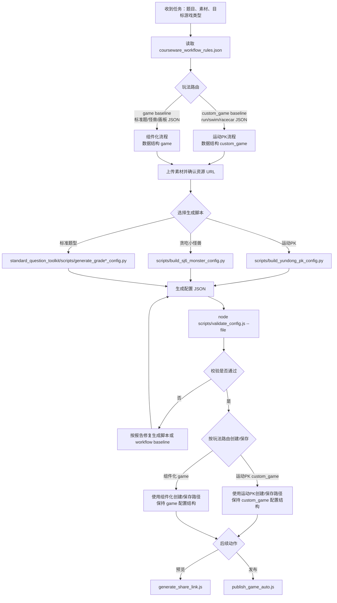

# CoursewareMaker 自动化工作流重构

## 核心原则

所有生成流程先路由，再生成，再用机器可读基准校验。流程路由不以游戏 ID 或模板 ID 为准，而以具体 baseline JSON 和配置根数据结构为准。题型与皮肤的正确配置基准统一保存在：

```text
standard_question_toolkit/data/courseware_workflow_rules.json
```

生成脚本只负责产出配置；`scripts/validate_config.js` 负责读取 workflow 基准并判断生成结果是否合规。

## 流程图



## 校验基准覆盖

`validation_baselines` 当前覆盖两层组合：运动 PK 三套皮肤，以及标准题型的题型 × 皮肤。

运动 PK：

| 玩法 | 基准 |
|---|---|
| 赛跑皮肤 | `yundong_pk__run` |
| 游泳皮肤 | `yundong_pk__swim` |
| 赛车皮肤 | `yundong_pk__racecar` |

标准题型：

| 玩法题型 | 紫色界面 | 黄色界面 | 蓝色界面 |
|---|---|---|---|
| 选择题 | `standard_choice__fc9fbc3b` | `standard_choice__e91dcb10` | `standard_choice__291cc642` |
| 填空/计算题 | `standard_fill_compute__fc9fbc3b` | `standard_fill_compute__e91dcb10` | `standard_fill_compute__291cc642` |
| 拖拽题 | `standard_drag__fc9fbc3b` | `standard_drag__e91dcb10` | `standard_drag__291cc642` |

每个 baseline 都包含该题型和皮肤下的 `expected_config`。运动 PK baseline 记录具体 JSON 路径、根结构和必需路径；标准题 baseline 记录背景图、题干文本 profile、交互组件状态资源。

## 生成后校验内容

- 根数据结构是否与玩法路由匹配：运动 PK 必须是 `custom_game`，组件化必须是 `game`。
- 运动 PK 是否能匹配 run / swim / racecar 具体 baseline JSON。
- 关卡皮肤背景是否匹配 workflow expected_config。
- 当前题型是否包含必需组件、是否混入互斥组件。
- 题干文本是否按单行字数规则拆成独立 label。
- 选择按钮、输入框、键盘、拖拽物、放置框资源是否来自对应皮肤的 expected_config。
- 固定布局常量是否符合 `layout_constants.json`。

## 维护规则

新增皮肤或题型时，先补 `courseware_workflow_rules.json` 的 baseline JSON 路径、`skins` / `yundong_pk_skins`、`gameplay_types` 和 `validation_baselines`，再更新生成脚本。校验脚本只读取 workflow 文件和 layout 常量，不在脚本里硬编码新皮肤资源。
